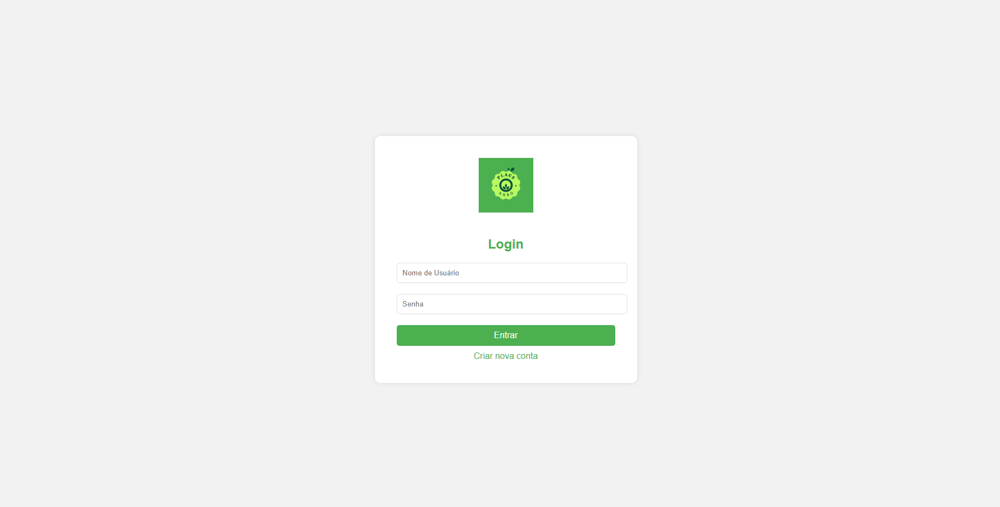

# Integrantes

Pedro Henrique Carbonera - carbonerapedro50@gmail.com

##  Place Agro (Marketing place Rural)

**Objetivo:**

**A Place Agro** surgiu ao identificar a necessidade de produtores rurais que, muitas vezes, dependem de feiras e eventos para anunciar suas colheitas e produtos. Desenvolvemos um Marketplace Rural, onde os produtores não dependem mais desses eventos para divulgar seus produtos. Agora, com apenas um celular, eles podem anunciar diversos itens a qualquer momento, facilitando e ampliando o comércio dos pequenos produtores rurais.

###  Como usar o Site

**Navegação**: Utilize o menu de navegação no cabeçalho para acessar as seções Início, Sobre, Vender, Contato, Login e Carrinho.

**Exploração de Produtos**: Veja as Ofertas do Dia, Produtos em Destaque e Produtos Mais Procurados. Clique em "Ver Mais" em cada card para detalhes adicionais.

**Informações**: Leia sobre a Place Agro e os requisitos atendidos em blocos de informações.

**Feedbacks**: Confira feedbacks e comentários de outros usuários.

**Contato**: Utilize a seção de contato para entrar em contato com a equipe.

**Funcionalidades:**

- **Venda de Produtos:**
   - Anuncie seu produto com imagem .
   - Descreva com detalhes o seu produto.
   - Defina um valor para seu produto.
- **Página inicial Completa:**
   - Organização dos produtos por ofertas, destaques e mais procurados.
   - Bloco de contato com formulario para deixar mensagens e localização da empresa linkada diretamente com google maps.
   - Campo de Feedbacks e comentarios de usuarios.
   - Campo com historia da empresa.
   - Foto e cargos dos integrantes da equipe.
   - Redes sociais do desenvolvedor/CEO. 
- **Segurança:**
   - Cadastro de contas para Vendedores e Compradores garanindo a segurança de cada usuario.
- **Compra de Produtos**
    - Carrinho para admministrar e fazer grandes compras de uma só vez.
- **Detalhes**
    - Botão que exibe os detalhes de um produto e exbibe qual o vendedor 

-  **Detalhes Vendedor**
    - Nas páginas de detalhes de produtos e de feedbacks e comentários, ao clicar no nome dos usuários/vendedores, é possível ver detalhes do vendedor, como email e endereço
   

   ### Algumas das páginas que você vai encontrar:

### Um pouco sobre o desenvolvimento

Optei por manter um código mais limpo, visando facilitar futuras manutenções e garantir que, em uma eventual venda do código-fonte, o comprador possa entendê-lo com facilidade. Para isso, utilizo elementos como **div**, **section**, **form**, e sempre incluo botões para tornar o site mais interativo e intuitivo para o usuário.

**Parceiros**

Parceiros que autorizaram captura de foto de seus produtos para a divulgação 

- **AgroRural**

- **Mercado São Miguel**

**Patrocinador**

Patrocinador que disponibilizou o DNS para o Site Place Agro

- **Harpa Tecnologia**

**Link do Site**
* https://placeagro.com.br